# 🗺️ Codebase Mind Map & Architecture Guide for Claude / LLMs

This document provides a token-efficient map of the **Monopoly Banking (International Mode)** codebase. Use this to quickly navigate the codebase without reading every file.

---

## 🏗️ High-Level System Architecture

```mermaid
graph TD
    AppLayout["app/_layout.tsx (Providers & Toast)"]
    
    subgraph Navigation ["Expo Router Pages (app/)"]
        Index["index.tsx (Home / Auth)"]
        Create["create.tsx (Host Setup)"]
        Join["join.tsx (Join Room)"]
        Lobby["lobby.tsx (Waiting Room)"]
        GameLayout["(game)/_layout.tsx (Game Tabs Header/Nav)"]
        
        Dashboard["(game)/dashboard.tsx (Overview / Actions)"]
        Properties["(game)/properties.tsx (Buy/Build/Mortgage)"]
        Pay["(game)/pay.tsx (P2P / Bank Transfers)"]
        Banker["(game)/banker.tsx (Host/Banker Tools)"]
        Activity["(game)/activity.tsx (Transaction Log)"]
    end

    subgraph StateManagement ["Zustand Stores (src/store/)"]
        useGameStore["useGameStore.ts (Game State + Firebase Sync)"]
        useAuthStore["useAuthStore.ts (Local User Profile)"]
        useNotificationStore["useNotificationStore.ts (Toasts)"]
        useThemeStore["useThemeStore.ts (Dark/Light Tokens)"]
    end

    subgraph LogicEngines ["Domain Logic (src/services/engine/)"]
        RentEngine["rentEngine.ts (Rent / Monopoly calculations)"]
        BuildingEngine["buildingEngine.ts (Houses/Hotels rules)"]
        TaxEngine["taxEngine.ts (Duties & Taxes)"]
    end

    subgraph FirebaseServices ["Firebase RTDB Services (src/services/firebase/)"]
        GameService["gameService.ts (Room Lifecycle & Sync)"]
        PropertyService["propertyService.ts (Ownership & Mortgages)"]
        TransactionService["transactionService.ts (Atomic Cash Transfers)"]
        TradeService["tradeService.ts (Player-to-Player Trades)"]
    end

    subgraph DataRegistries ["Static Constants (src/constants/)"]
        BoardReg["boardRegistry.ts (22 Properties & Deeds Data)"]
        CardsReg["cardsRegistry.ts (Chance & Community Cards)"]
    end

    Index --> useAuthStore
    GameLayout --> useGameStore
    Dashboard --> LogicEngines
    Dashboard --> TransactionService
    Properties --> BuildingEngine
    Properties --> PropertyService
    useGameStore <--> FirebaseServices
    FirebaseServices --> TransactionService
```



---

## 📁 Directory & Key File Map

```
Monopoly/
├── app/                      # Expo Router Screens & Layouts
│   ├── _layout.tsx           # Global Root Layout (Toast Provider, Theme)
│   ├── index.tsx             # Home Screen (Create/Join buttons, User Info)
│   ├── create.tsx            # Create Room Screen
│   ├── join.tsx              # Join Room Screen (Code input)
│   ├── lobby.tsx             # Room Lobby (Player list, Start game)
│   └── (game)/               # Game Navigation Group (Tabbed UI)
│       ├── _layout.tsx       # Header, Bottom Navigation, Modals
│       ├── dashboard.tsx     # Player Balance, Quick Actions, Dice Roll, Cards
│       ├── properties.tsx    # Property Deeding, House/Hotel Building, Mortgaging
│       ├── pay.tsx           # Direct Cash Transfer (P2P, Go Salary, Taxes, Rent)
│       ├── banker.tsx        # Banker Admin Panel (Auction, Force Transfer)
│       └── activity.tsx      # Real-time Activity Feed & Filtered Logs
│
├── src/
│   ├── constants/            # Immutable Game Configs
│   │   ├── boardRegistry.ts  # Properties DB (Prices, Rents, Groups)
│   │   ├── cardsRegistry.ts  # Chance & Community Chest Card decks
│   │   ├── theme.ts          # Color Tokens (Dark/Light Mode)
│   │   └── textures.ts       # Textures/Assets
│   │
│   ├── store/                # Global React State (Zustand)
│   │   ├── useAuthStore.ts   # Current player profile (ID, Name, Color, Avatar)
│   │   ├── useGameStore.ts   # Active room session, players list, property state
│   │   ├── useNotificationStore.ts # Toast notifications queue
│   │   └── useThemeStore.ts  # Active theme state & switcher
│   │
│   ├── services/
│   │   ├── engine/           # Pure Rule Engines
│   │   │   ├── rentEngine.ts     # Rent calculations (Monopoly double, houses, transport)
│   │   │   ├── buildingEngine.ts # Building validations (Even build, max 3 house -> hotel)
│   │   │   └── taxEngine.ts      # Custom Duty ($100/site), Travel Duty ($50/site)
│   │   │
│   │   └── firebase/         # Realtime DB Async Actions
│   │       ├── config.ts         # Firebase Initialization
│   │       ├── gameService.ts    # Room creation, joining, starting, RTDB listeners
│   │       ├── propertyService.ts# Buying, mortgaging, upgrading houses/hotels
│   │       ├── transactionService.ts # Atomic cash adjustments & transaction logging
│   │       └── tradeService.ts   # Propose, accept, reject player trades
│   │
│   ├── components/           # UI Components
│   │   ├── banking/          # QuickPayModal.tsx, CardDrawerModal.tsx
│   │   ├── trading/          # TradeModal.tsx, IncomingTradeModal.tsx
│   │   ├── notifications/    # NotificationToast.tsx
│   │   └── ui/               # Button.tsx, Input.tsx, PlayerAvatar.tsx, PlayerBadge.tsx
│   │
│   └── types/                # TypeScript Interface Contracts
│       ├── game.ts           # GameSession, Player, GameStatus
│       ├── property.ts       # PropertyDeed, PropertyState, PropertyGroup
│       ├── transaction.ts    # Transaction, TransactionCategory
│       ├── trade.ts          # TradeProposal, TradeStatus
│       ├── cards.ts          # Card definition
│       └── notification.ts   # NotificationItem
```

---

## ⚡ Core Data Flow & Real-time State Pattern

1. **Firebase RTDB Structure (`games/{roomCode}/`)**:
   - `session`: Game status, hostId, bankerId, createdAt
   - `players/{playerId}`: Balance, name, color, avatar, inJail, bankrupt status
   - `properties/{propertyId}`: `ownerId`, `houses` (0-3), `hotel` (boolean), `isMortgaged` (boolean)
   - `transactions/{txId}`: Sender, receiver, amount, category, reason, timestamp
   - `trades/{tradeId}`: Sender/Receiver items & cash, proposal status

2. **Zustand Subscription Model (`useGameStore`)**:
   - When entering a room, `subscribeToGame(roomCode)` attaches Firebase RTDB `.on('value')` listeners.
   - Any RTDB change immediately updates `useGameStore` state -> triggers React re-render.
   - Actions in UI call `propertyService`, `transactionService`, or `tradeService` -> writes to RTDB.

---

## 📜 Business Rules Quick Reference (International Monopoly Rules)

- **Starting Cash**: $25,000 per player
- **GO Salary**: $1,500
- **Building Rules**: Maximum **3 Houses** per property before upgrading to **1 Hotel**. Even building rule applies across region groups. Buildings sell back at 50%.
- **Regional Monopoly**: Owning all 3 properties in a region group doubles base rent (if unbuilt & unmortgaged).
- **Duties**: Custom Duty ($100 per owned property site), Travelling Duty ($50 per owned property site).
- **Jail**: $50 fine to exit or roll doubles within 3 turns ($500 forced exit on turn 3). In-jail players can still collect rent, build, and trade.
- **Transports**: Rent scales with number of transports owned (1 vs 2 owned).

---

## 🛠️ Common Tasks & Target Files

| Goal / Requirement | Target Files |
| :--- | :--- |
| **Add/Modify Rent Rules** | `src/services/engine/rentEngine.ts`, `src/constants/boardRegistry.ts` |
| **Change UI Theme / Palette** | `src/constants/theme.ts`, `src/store/useThemeStore.ts` |
| **Add New Transaction Reason** | `src/types/transaction.ts`, `src/services/firebase/transactionService.ts` |
| **Modify Trade Logic** | `src/services/firebase/tradeService.ts`, `src/components/trading/TradeModal.tsx` |
| **Change House/Hotel Limits** | `src/services/engine/buildingEngine.ts`, `src/types/game.ts` |
| **Update Card Effects** | `src/constants/cardsRegistry.ts`, `src/components/banking/CardDrawerModal.tsx` |
| **Add Realtime Database Fields**| `database.rules.json`, `src/types/game.ts`, `src/services/firebase/gameService.ts` |
